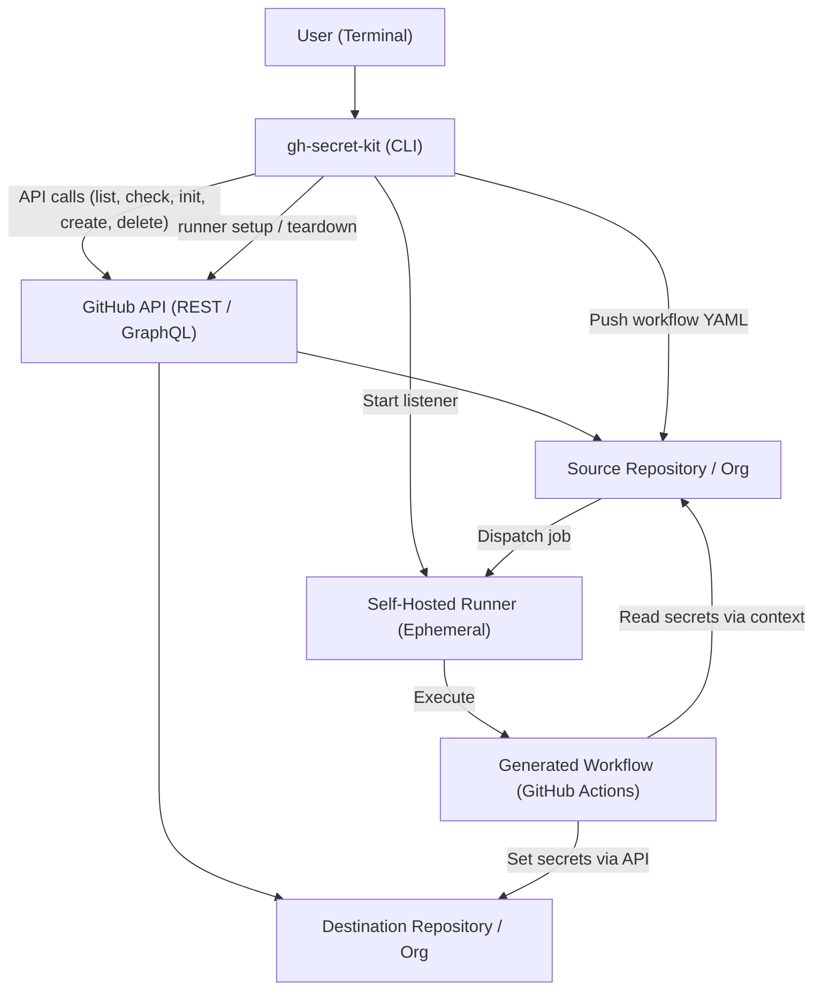
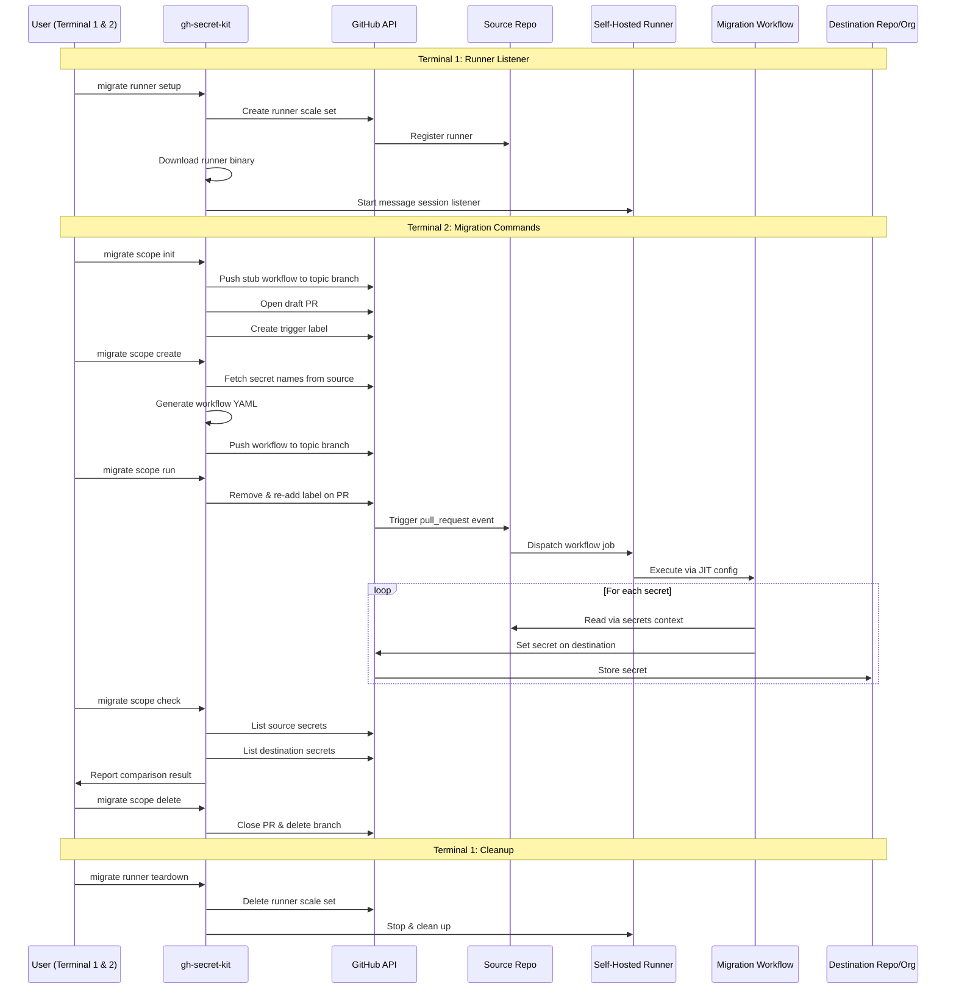
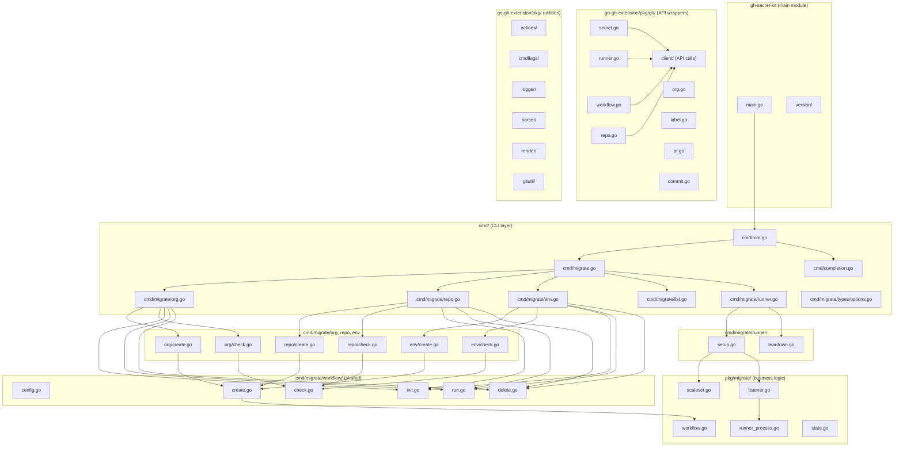
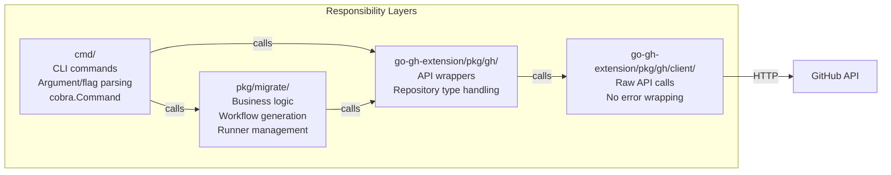
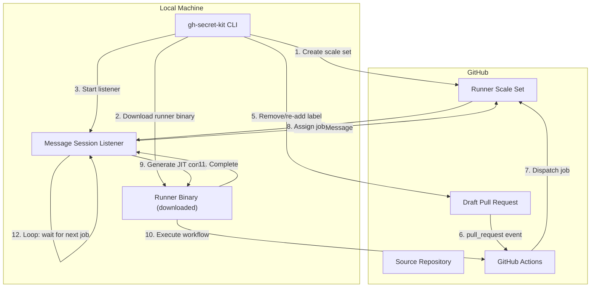
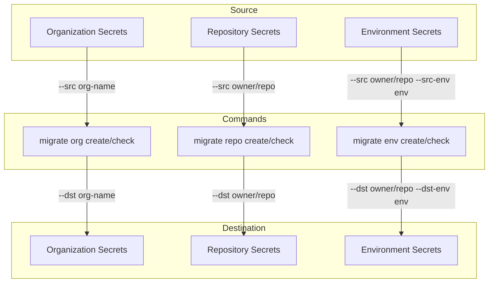

# gh-secret-kit - System Architecture

## Overview

`gh-secret-kit` is a GitHub CLI (`gh`) extension for managing GitHub Actions secrets. It is built in Go using the [cobra](https://github.com/spf13/cobra) CLI framework and communicates with GitHub via the GitHub REST/GraphQL API.

## High-Level Architecture

## Migration Data Flow

## Module Structure

## Package Responsibility

| Layer | Package | Responsibility |
| --- | --- | --- |
| CLI | `cmd/` | cobra.Command definitions, argument/flag parsing, user-facing error messages |
| CLI | `cmd/migrate/` | Parent command registration, scope-level command grouping (org/repo/env), `plan` and `check` commands |
| CLI | `cmd/migrate/workflow/` | Shared init/create/run/delete/check logic across scopes |
| CLI | `cmd/migrate/{org,repo,env}/` | Scope-specific create/check commands |
| CLI | `cmd/migrate/runner/` | Runner setup/teardown commands |
| CLI | `cmd/migrate/types/` | Shared option types |
| Business | `pkg/migrate/` | Workflow YAML generation, scaleset management, runner process lifecycle, listener loop |
| Business | `pkg/migrator/` | Organization-level scan logic: matching repos, collecting env secrets/variables, deploy key discovery |
| Business | `pkg/config/` | Environment configuration export/import: YAML serialization, `Importer` with `ImportOptions` (overwrite, usermap) |
| API Wrapper | `go-gh-extension/pkg/gh/` | GitHub API wrappers using `repository.Repository` type, `ctx` + `*GitHubClient` convention |
| API Client | `go-gh-extension/pkg/gh/client/` | Raw go-github API calls, no error formatting |
| Utility | `go-gh-extension/pkg/{actions,cmdflags,logger,parser,render,gitutil}/` | Cross-cutting utilities |
| Utility | `go-gh-extension/pkg/settings/` | User mapping (login → login): file load, regex-capable `CompiledMappings`, `ResolveSrc` |

## Runner Architecture

## Secret Migration Scopes

